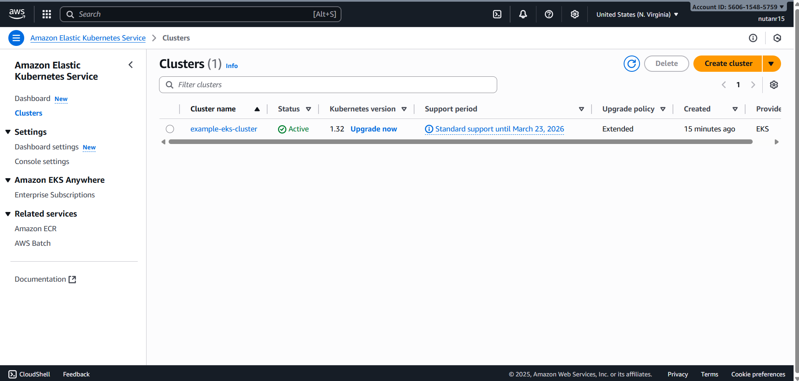
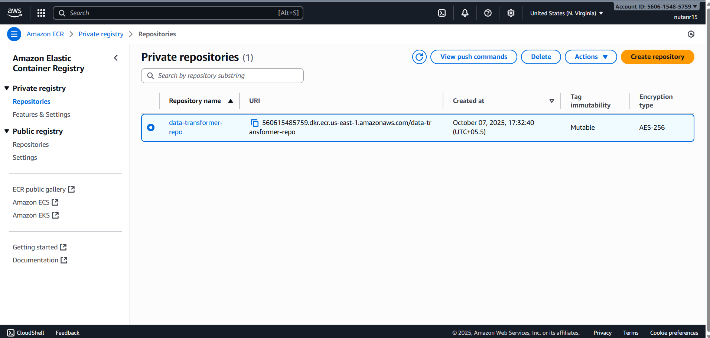

# TG-DevOps Hands-On Assignment: EKS Data Transformer

## Overview

This project demonstrates a complete DevOps workflow using **AWS EKS, Terraform, Docker, and GitHub Actions**.  

The system runs a Python script (`process.py`) daily in Kubernetes to:

- Read a CSV file from a **raw-data S3 bucket**
- Uppercase the `name` column
- Write the transformed data to a **processed-data S3 bucket**

All access is **role-based (IRSA)** — no AWS credentials are hardcoded in the code or containers.

---

## Repository Structure

```
.
├── app/
│   ├── process.py
│   ├── requirements.txt
│   └── Dockerfile
├── infra/
│   ├── provider.tf
│   ├── variables.tf
│   ├── s3.tf
│   ├── ecr.tf
│   ├── eks.tf
│   ├── iam-irsa.tf
│   └── outputs.tf
├── k8s/
│   ├── serviceaccount.yaml
│   ├── rbac.yaml
│   └── cronjob.yaml
└── .github/
    └── workflows/
        └── ci-cd.yml
```

---

## Infrastructure Setup (Terraform)

Terraform provisions the following AWS resources:

- **S3 Buckets**  
  - `raw-data-dev-nutan`  
  - `processed-data-dev-nutan`
- **ECR Repository** for Docker image  
  - `data-transformer-repo`
- **EKS Cluster** inside an existing VPC  
  - `devops-eks-cluster`
- **IAM Role for Service Account (IRSA)**  
  - `s3-access-sa` → allows pods to read/write S3 without AWS keys

### Deployment

```bash
cd infra
terraform init
terraform apply -auto-approve
```



After Terraform completes, configure `kubectl` to use the cluster:

```bash
terraform output kubeconfig_command
# Example:
# aws eks update-kubeconfig --region us-east-1 --name devops-eks-cluster
kubectl get nodes
```

---

## Docker Image Build

The Python app is containerized.

```bash
cd app
docker build -t data-transformer:latest .
```

Push to ECR (after Terraform creates the repo):

```bash
aws ecr get-login-password --region us-east-1 | docker login --username AWS --password-stdin <AWS_ACCOUNT_ID>.dkr.ecr.us-east-1.amazonaws.com
docker tag data-transformer:latest <AWS_ACCOUNT_ID>.dkr.ecr.us-east-1.amazonaws.com/data-transformer-repo:latest
docker push <AWS_ACCOUNT_ID>.dkr.ecr.us-east-1.amazonaws.com/data-transformer-repo:latest
```

---

## Kubernetes Deployment

### 1. ServiceAccount with IRSA

`k8s/serviceaccount.yaml` binds Kubernetes pods to the IAM role to ensure S3 access without AWS keys.

```yaml
apiVersion: v1
kind: ServiceAccount
metadata:
  name: s3-access-sa
  namespace: default
  annotations:
    eks.amazonaws.com/role-arn: <IRSA_ROLE_ARN>
```

---

### 2. RBAC

`k8s/rbac.yaml` provides minimal permissions for the CronJob:

```yaml
apiVersion: rbac.authorization.k8s.io/v1
kind: Role
metadata:
  name: cronjob-minimal-role
  namespace: default
rules:
- apiGroups: [""]
  resources: ["configmaps", "secrets"]
  verbs: ["get","list"]

---
apiVersion: rbac.authorization.k8s.io/v1
kind: RoleBinding
metadata:
  name: cronjob-minimal-rolebinding
  namespace: default
subjects:
- kind: ServiceAccount
  name: s3-access-sa
  namespace: default
roleRef:
  kind: Role
  name: cronjob-minimal-role
  apiGroup: rbac.authorization.k8s.io
```

---

### 3. CronJob

`k8s/cronjob.yaml` runs daily at 02:00 UTC, with liveness/readiness probes:

```yaml
apiVersion: batch/v1
kind: CronJob
metadata:
  name: data-transform-job
  namespace: default
spec:
  schedule: "0 2 * * *"
  successfulJobsHistoryLimit: 3
  failedJobsHistoryLimit: 2
  jobTemplate:
    spec:
      template:
        spec:
          serviceAccountName: s3-access-sa
          restartPolicy: OnFailure
          containers:
          - name: data-transform
            image: <ECR_IMAGE_URI>:latest
            env:
            - name: RAW_BUCKET
              value: raw-data-dev-nutan
            - name: PROCESSED_BUCKET
              value: processed-data-dev-nutan
            - name: INPUT_KEY
              value: input.csv
            - name: OUTPUT_KEY
              value: output.csv
            resources:
              requests:
                cpu: "200m"
                memory: "256Mi"
              limits:
                cpu: "500m"
                memory: "512Mi"
            livenessProbe:
              exec:
                command: ["pgrep", "-f", "process.py"]
              initialDelaySeconds: 10
              periodSeconds: 10
            readinessProbe:
              exec:
                command: ["pgrep", "-f", "process.py"]
              initialDelaySeconds: 5
              periodSeconds: 5
```

Apply manifests:

```bash
kubectl apply -f k8s/serviceaccount.yaml
kubectl apply -f k8s/rbac.yaml
kubectl apply -f k8s/cronjob.yaml
```

Verify:

```bash
kubectl get cronjobs
kubectl get jobs
kubectl logs job/<job-name>
```

---

## CI/CD Pipeline (GitHub Actions)

- `.github/workflows/ci-cd.yml` automates:

1. Terraform apply (infrastructure)
2. Docker build & push to ECR
3. CronJob deployment/update on EKS

Secrets required in GitHub:

| Secret               | Value / Notes |
|---------------------|---------------------------|
| AWS_ACCOUNT_ID       | Your AWS Account ID       |
| AWS_ROLE_TO_ASSUME   | IAM role ARN for GitHub OIDC |

---

## Testing

1. Upload sample CSV:

```bash
aws s3 cp data/sample_input.csv s3://raw-data-dev-nutan/input.csv
```

2. Trigger manual run:

```bash
kubectl create job --from=cronjob/data-transform-job manual-run-$(date +%s)
kubectl logs -f <pod-name>
```

3. Check processed output:

```bash
aws s3 ls s3://processed-data-dev-nutan/
aws s3 cp s3://processed-data-dev-nutan/output.csv .
cat output.csv
```

---


